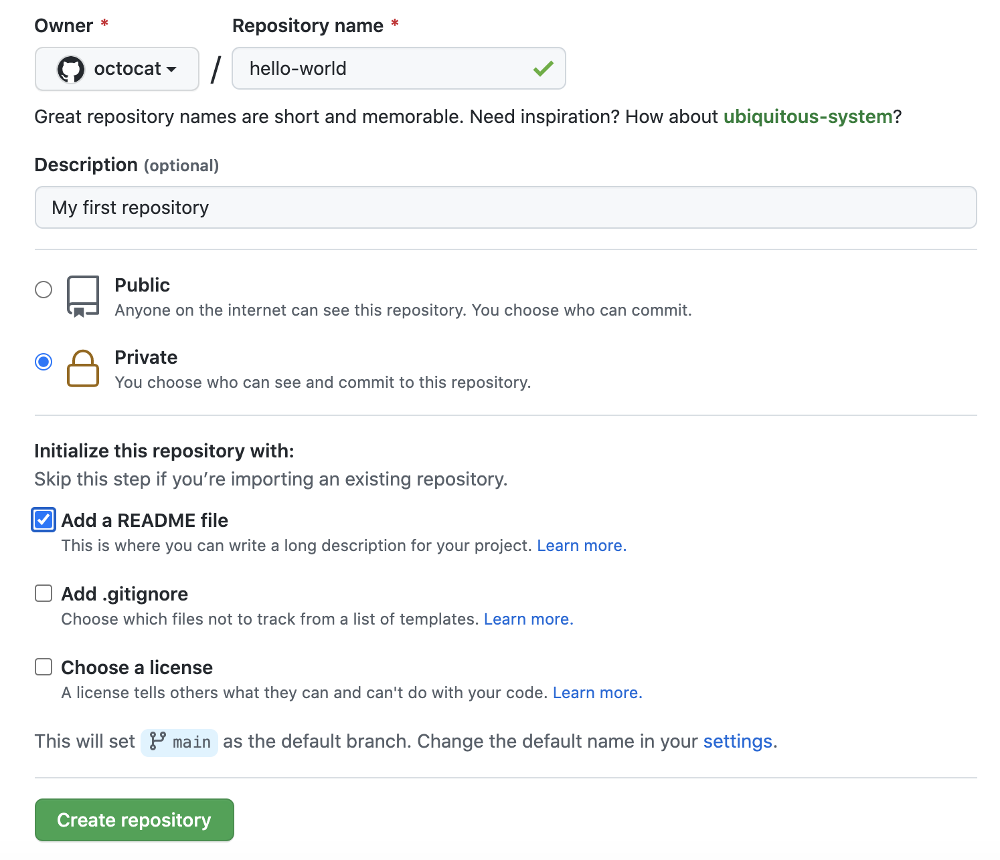
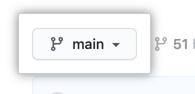
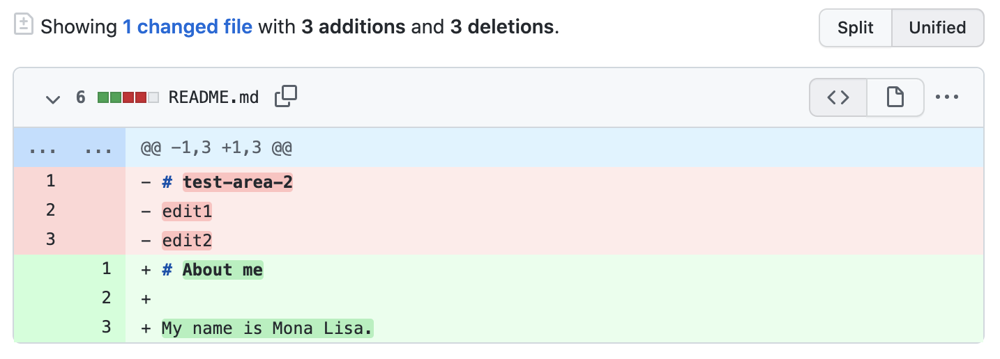

<link rel="stylesheet" href="https://cdnjs.cloudflare.com/ajax/libs/reveal.js/4.4.0/reveal.min.css">
<link rel="stylesheet" href="https://cdnjs.cloudflare.com/ajax/libs/reveal.js/4.4.0/reveal.js">
<link rel="stylesheet" href="https://cdnjs.cloudflare.com/ajax/libs/reveal.js/4.4.0/theme/black.min.css">
<link rel="stylesheet" href="https://cdnjs.cloudflare.com/ajax/libs/reveal.js/4.4.0/plugin/highlight/highlight.min.js">

<!-- .slide: data-background="bvjsc-54*54.png" -->

## Hacktoberfest 2022

::: block
Organised by
*BV Jagadeesh Science Centre* 
in association with 
Dept. of Computer Science, 
National College Jayanagar
{style=background:red;width:100px}
::: 

---

Sigma Club members@workshop

   - Charan Yadav
   - Spoorti K
   - Bhargav Ram
   - Uday Kiran N

---

Contributions

   - Chandan NL
   - Shashank A
   - Chandhan SS

---

## Session 1 - Getting started with Github

--

#### What is Github

GitHub is a code hosting platform for version control and collaboration. It lets you and others work together on projects from anywhere.

--

#### Are there alternatives to Github?

Yes, Gitlab, Gitea and many more

--

#### Signing up for a new GitHub account  

--

#### Introduction 

- Home page
- Explore, trending options
- Issues
- Notifications
- Repository
- Organisation
- Stars

--

#### Demonstration 

How to search for a project and star it?

--

#### Exercise

Search for a project in your subject and star it.(some topics - open source university, awesome)

---

#### Activity 01 
### Creating your first repo and editing it

--

#### Demonstration - How to create a repository? 

---

#### Activity 01 
### 1. Creating a repository

- In the upper-right corner of any page, use the  drop-down menu, and select New repository.

--

- In the Repository name box, enter **Notes** as repo name
- In the Description box, write a short description.(My Notes at Hacktoberfest)
- Select Add a README file.
- Select whether your repository will be Public or Private.
- Select a license - MIT License

--

- Click Create repository.

--

#### Exercise - Create your first repository

Edit the README file with little introduction of file, comment and save changes, refer to markdown cheatsheet

---

### Activity 01 
#### 2. Creating a branch

--

#### Demonstration -  creating a branch in the first repo.

--

Have you ever saved different versions of a file? Something like:

- design1.html
- design-with-navbar.html
- final-design.html

--

#### What is a good solution for this?

--

- Click the Code tab of your **Notes** repository.
- Click the drop down at the top of the file list that says main.

--

- Type a branch name - **activity1-notes**, into the text box.
- Click Create branch: activity1-notes from main.

--

- Now you have two branches, main and activity1-notes. Right now, they look exactly the same. Next you'll add changes to the new branch.

--

#### Exercise - create a new hello-world repo and create a new branch called 1-edit-readme

---

#### Activity 01 
### 3. Editing and committing changes

--

#### Demonstration - making changes and committing it in the first repo.

--

- Under the activity1-notes branch you created, click the README.md file.
- Click at pencil symbol to edit the file.
- In the editor, write a bit about yourself. Try using different Markdown elements.
- In the Commit changes box, write a commit message that describes your changes.

--

- Click Commit changes.

--

#### Exercise - create a branch in your first repo

---

#### Activity 01 
### 4. Opening a pull request

--

#### Demonstration - Creating a PR in my repo, and mentioning my friend’s name

--

- Click the Pull requests tab of your activity1-notes repository.
- Click New pull request
- In the Example Comparisons box, select the branch you made, activity1-notes, to compare with main (the original).

--

- Look over your changes in the diffs on the Compare page, make sure they're what you want to submit.

--

- Pull requests are the heart of collaboration on GitHub. When you open a pull request, you're proposing your changes and requesting that someone review and pull in your contribution and merge them into their branch. Pull requests show diffs, or differences, of the content from both branches. The changes, additions, and subtractions are shown in different colors.

--

- As soon as you make a commit, you can open a pull request and start a discussion, even before the code is finished.
- By using GitHub's @mention feature in your pull request message, you can ask for feedback from specific people or teams, whether they're down the hall or 10 time zones away.

--

- You can even open pull requests in your own repository and merge them yourself. It's a great way to learn the GitHub flow before working on larger projects.

--

#### Exercise - Creating a PR in hello-world from branch(1-edit-readme) and mention your  friend’s name that you have finished doing it

---

#### Activity 01 
### 5. Merging your pull request

--

#### Demonstration - merge your activity1-notes branch into the main branch.

--

- Click Merge pull request to merge the changes into main.

- Click **Confirm merge**. You will receive a message that the request was successfully merged and the request was closed.

--

- Click **Delete branch**.

Now that your pull request is merged and your changes are on main, you can safely delete the 1-edit-readme branch. If you want to make more changes to your project, you can always create a new branch and repeat this process.

--

#### Exercise - Merge your 1-edit-readme branch into the main branch in hello-world repo. 

After you merge your pull request, the changes on your 1-edit-readme branch will be incorporated into main.

---

### Activity 02 
#### Create your profile using README

You can create your custom profile that would be displayed whenever some user visits your profile.

--

#### Exercise - Create a repo and name it your username and include a README file while creating the repo.

- [X] Use the markdown cheatsheet
- [ ] For comprehensive understanding, refer to this article from Github

--

Markdown consists of a set of symbols inserted in a document ending with .md suffix to control its structure, formatting, or the relationship between its parts.

---

